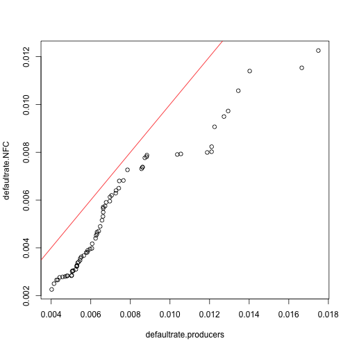
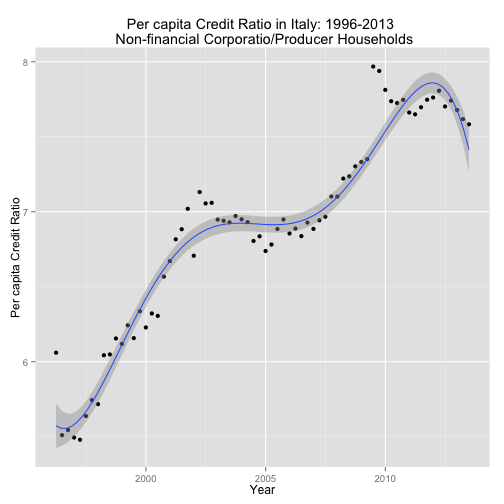
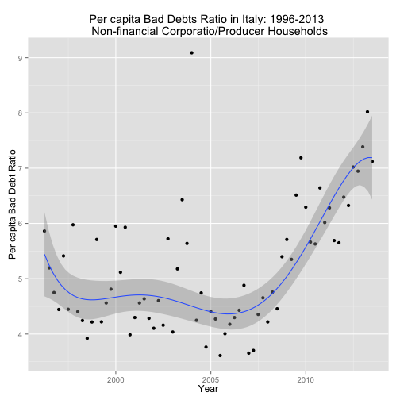
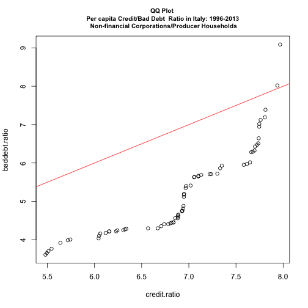

Title : The Italian Crisis and Producer Households Debt: a Source of Stability? A Reproducible Research
==============================================================
Stefano Olgiati, Gilberto Bronzini, Alessandro Danovi 
-----------------------------------------------------------------

_University of Bergamo_
-----------------------------------------------------------------

### Legenda and Reproducible Data Source

LEGENDA BANCA D'ITALIA TDB30486_DOMI_ENG.TXT  

> ENTE_SEGN  REPORTING INSTITUTION  
3691030	BANKS, FINANCIAL COMPANIES AND OTHER INSTITUTIONS REPORTING TO THE CCR  

> VOCESOTVOC | PHENOMENA OBSERVED  
351122133	LOAN FACILITIES (EXCLUDING ADJUSTED BAD DEBTS) : CREDIT USED  
351122141	LOAN FACILITIES (EXCLUDING ADJUSTED BAD DEBTS) : NUMBER OF BORROWERS  
035120163	QUARTERLY DEFALUT RATES FOR LOAN FACILITIES : NUMER OF BORROWERS)  
035120363	QUARTERLY DEFAULT RATES FOR LOAN FACILITIES : CREDIT USED  
351121433	QUARTERLY FLOW - ADJUSTED BAD DEBTS AT T FROM PERFORMING LOANS AT T-1: AMOUNT  
351121441	QUARTERLY FLOW - ADJUSTED BAD DEBTS AT T FROM PERFORMING LOANS AT T-1:BORROWERS  

> CLASSE_UTI	TOTAL CREDIT USED (SIZE CLASSES)  
1006	500,000 EUROS AND MORE  
1005	FROM >= 125,000 TO < 500,000 EUROS  
1004	LESS THAN 125,000 EUROS  
9904	TOTAL (>=0)  

> SETCON	CUSTOMER SECTORS AND SEGMENTS OF ECONOMIC ACTIVITY  
7015	CONSUMER HOUSEHOLDS  
0026	FINANCIAL COMPANIES OTHER THAN MONETARY FINANCIAL INSTITUTIONS  
0001	GENERAL GOVERNMENT  
7006	NON-FINANCIAL CORPORATIONS  
7009	NON-PROFIT INSTITUTIONS SERVING HOUSEHOLDS AND UNCLASSIFIABLE UNITS  
7010	PRODUCER HOUSEHOLDS  
4015	TOTAL RESIDENT SECTOR EXCLUDING MFIS  

Download data from Banca d'Italia Public Online Database BIP Online: URI "http://bip.bancaditalia.it/4972unix/pls/4972unix_cartridge/scaricapkg.frameS?lang=ENG&p_tavola=TDB30486&da_dove=&dat_agg=&P1_VARPIANO_VAL=035120163]00001]3691030]&P1_VARCELLA=VALORE]&P1_VARRIGA=DATA_OSSER]&P1_VARCOLONNA=CLASSE_UTI]&P1_VARPIANO=VOCESOTVOC]SETCON]ENTE_SEGN]&P1_IDENTREPORT=2248&P1_OPZIONI=00D&pNumCol=4&pNumRow=25&pPagUtente=NO&pvFuoriPiano=&id_sessione=2905&pvUtenza=&pvValuta="

Choose option:
2. Data: whole table (*)


```r
data = url("https://github.com/SAO65/IRMC2014/blob/master/TDB30486_EURO_ENG.csv")
head(data)
```

```
## [1] 5
```

```r
input.data = read.csv("/Users/Stefanoolgiati/Desktop/IRMC2014/TDB30486_ENG_ALL_INPUT/TDB30486_EURO_ENG.csv")
head(input.data)
```

```
##   ENTE_SEGN VOCESOTVOC CLASSE_UTI SETCON DATA_OSSER VALORE STATUS
## 1   3691030   35120163       1004      1  31/3/2013  0.037     NA
## 2   3691030   35120163       1004      1  30/6/2012  0.047     NA
## 3   3691030   35120163       1004      1  30/9/2011  0.047     NA
## 4   3691030   35120163       1004      1  30/6/2011  0.048     NA
## 5   3691030   35120163       1004      1 31/12/2009  0.096     NA
## 6   3691030   35120163       1004      1  30/9/2009  0.045     NA
##   UNIT.OF.MEASUREMENT                 SCALE
## 1        PURE NUMBERS PERCENTAGE/HUNDREDTHS
## 2        PURE NUMBERS PERCENTAGE/HUNDREDTHS
## 3        PURE NUMBERS PERCENTAGE/HUNDREDTHS
## 4        PURE NUMBERS PERCENTAGE/HUNDREDTHS
## 5        PURE NUMBERS PERCENTAGE/HUNDREDTHS
## 6        PURE NUMBERS PERCENTAGE/HUNDREDTHS
```

```r
tail(input.data)
```

```
##       ENTE_SEGN VOCESOTVOC CLASSE_UTI SETCON DATA_OSSER VALORE STATUS
## 11191   3691030  351122141       9904   7015  30/6/1997 180845     NA
## 11192   3691030  351122141       9904   7015  31/3/1997 164303     NA
## 11193   3691030  351122141       9904   7015 31/12/1996 161447     NA
## 11194   3691030  351122141       9904   7015  30/9/1996 162397     NA
## 11195   3691030  351122141       9904   7015  30/6/1996 158706     NA
## 11196   3691030  351122141       9904   7015  31/3/1996 512619     NA
##       UNIT.OF.MEASUREMENT SCALE
## 11191               UNITS  UNIT
## 11192               UNITS  UNIT
## 11193               UNITS  UNIT
## 11194               UNITS  UNIT
## 11195               UNITS  UNIT
## 11196               UNITS  UNIT
```


Installing R packages for analysis and synthesis


```r
require(data.table)
```

```
## Loading required package: data.table
```

```r
require(ggplot2)
```

```
## Loading required package: ggplot2
```

```r
require(MASS)
```

```
## Loading required package: MASS
```

```r
require(markdown)
```

```
## Loading required package: markdown
```

```r
require(knitr)
```


### Parsing data, creating the data frame and calculating ratios for Households and Non-financial Corporations Credit and Bad Debts in Italy: 1996-2013


```r
raw.data = data.frame(SEGMENT = input.data$SETCON, PHENOMENA = input.data$VOCESOTVOC, 
    SIZE_CLASS = input.data$CLASSE_UTI, DATE = as.Date(input.data$DATA_OSSER, 
        "%d/%m/%Y"), VALUE = input.data$VALORE)
total.data = raw.data[raw.data$SIZE_CLASS %in% c("9904"), ]
```


Extracting data on producer households


```r
households.producer.data = total.data[total.data$SEGMENT %in% c("7010"), ]
loan.amount.producer.data = households.producer.data[households.producer.data$PHENOMENA %in% 
    c("351122133"), ]
loan.borrowers.producer.data = households.producer.data[households.producer.data$PHENOMENA %in% 
    c("351122141"), ]
default.amount.producer.data = households.producer.data[households.producer.data$PHENOMENA %in% 
    c("351121433"), ]
default.borrowers.producer.data = households.producer.data[households.producer.data$PHENOMENA %in% 
    c("351121441"), ]
```


Extracting data on non-financial corporations (NFC)


```r
NFC.data = total.data[total.data$SEGMENT %in% c("7006"), ]
loan.amount.NFC.data = NFC.data[NFC.data$PHENOMENA %in% c("351122133"), ]
loan.borrowers.NFC.data = NFC.data[NFC.data$PHENOMENA %in% c("351122141"), ]
default.amount.NFC.data = NFC.data[NFC.data$PHENOMENA %in% c("351121433"), ]
default.borrowers.NFC.data = NFC.data[NFC.data$PHENOMENA %in% c("351121441"), 
    ]
```


Making a new data frame with producer households and NFC


```r
data.df.reverse = data.frame(Date = loan.amount.producer.data$DATE, Credit_Amount_Producer = loan.amount.producer.data$VALUE, 
    Credit_Borrowers_Producer = loan.borrowers.producer.data$VALUE, Default_Amount_Producer = default.amount.producer.data$VALUE, 
    Default_Borrowers_Producer = default.borrowers.producer.data$VALUE, Credit_Amount_NFC = loan.amount.NFC.data$VALUE, 
    Credit_Borrowers_NFC = loan.borrowers.NFC.data$VALUE, Default_Amount_NFC = default.amount.NFC.data$VALUE, 
    Default_Borrowers_NFC = default.borrowers.NFC.data$VALUE)
```


Defining the ratio of per capita credit and bad debts between NFC and producer households

$credit.NFC.percapita=Credit Amount NFC/Credit Borrowers NFC$
$default.NFC.percapita=Default Amount NFC/Default Borrowers NFC$
$credit.producers.percapita=Credit Amount Producer/Credit Borrowers Producer$
$default.producers.percapita=Default Amount Producer/Default Borrowers Producer$

Defining the ratio of per capita credit and bad debts between NFC and producer households

$$credit.ratio=credit.NFC.percapita/credit.producers.percapita.$$
$$baddebt.ratio=baddebt.NFC.percapita/baddebt.producers.percapita$$

Calculating the ratio of per capita credit between NFC and producer households


```r
credit.producers.percapita = (data.df.reverse[, "Credit_Amount_Producer"]/data.df.reverse[, 
    "Credit_Borrowers_Producer"])
credit.NFC.percapita = (data.df.reverse[, "Credit_Amount_NFC"]/data.df.reverse[, 
    "Credit_Borrowers_NFC"])
credit.ratio = credit.NFC.percapita/credit.producers.percapita
```


Calculating the ratio of per capita bad debts between NFC and producer households


```r
baddebt.producers.percapita = (data.df.reverse[, "Default_Amount_Producer"]/data.df.reverse[, 
    "Default_Borrowers_Producer"])
baddebt.NFC.percapita = (data.df.reverse[, "Default_Amount_NFC"]/data.df.reverse[, 
    "Default_Borrowers_NFC"])
baddebt.ratio = baddebt.NFC.percapita/baddebt.producers.percapita
```


Calculating the average default rates and standard deviation


```r
defaultrate.producers = (data.df.reverse[, "Default_Amount_Producer"]/data.df.reverse[, 
    "Credit_Amount_Producer"])
defaultrate.NFC = (data.df.reverse[, "Default_Amount_NFC"]/data.df.reverse[, 
    "Credit_Amount_NFC"])
summary(defaultrate.producers)
```

```
##    Min. 1st Qu.  Median    Mean 3rd Qu.    Max. 
## 0.00403 0.00531 0.00644 0.00734 0.00839 0.01750
```

```r
variationCoefficient.producers = sd(defaultrate.producers)/mean(defaultrate.producers)
variationCoefficient.producers
```

```
## [1] 0.4064
```

```r
summary(defaultrate.NFC)
```

```
##    Min. 1st Qu.  Median    Mean 3rd Qu.    Max. 
## 0.00226 0.00329 0.00480 0.00545 0.00730 0.01230
```

```r
variationCoefficient.NFC = sd(defaultrate.NFC)/mean(defaultrate.NFC)
variationCoefficient.NFC
```

```
## [1] 0.4564
```

```r

qqplot(defaultrate.producers, defaultrate.NFC)
abline(c(0, 0), c(1, 1), col = "red")
```

 


Making syhthesis data frame of per capita credit, per capita bad debt and ratios


```r
syn.data.reverse.df = data.frame(Date = loan.amount.producer.data$DATE, Per_Capita_Credit_NFC = credit.NFC.percapita, 
    Per_Capita_Credit_Producers = credit.producers.percapita, Credit_Ratio = credit.ratio, 
    Per_Capita_Baddebts_NFC = baddebt.NFC.percapita, Per_Capita_Baddebts_Producers = baddebt.producers.percapita, 
    Baddebt_Ratio = baddebt.ratio)
```


Reversing data frame: head = begin_date and tail = end_date


```r
syn.data.df = syn.data.reverse.df[order(loan.amount.producer.data$DATE), ]
syn.data.dtable = as.data.table(syn.data.df)
```


### Summary of parsed Data


```r
summary(syn.data.dtable)
```

```
##       Date            Per_Capita_Credit_NFC Per_Capita_Credit_Producers
##  Min.   :1996-03-31   Min.   : 689          Min.   :114                
##  1st Qu.:2000-07-23   1st Qu.: 975          1st Qu.:142                
##  Median :2004-11-15   Median :1084          Median :156                
##  Mean   :2004-11-14   Mean   :1074          Mean   :156                
##  3rd Qu.:2009-03-08   3rd Qu.:1139          3rd Qu.:167                
##  Max.   :2013-06-30   Max.   :1406          Max.   :191                
##   Credit_Ratio  Per_Capita_Baddebts_NFC Per_Capita_Baddebts_Producers
##  Min.   :5.48   Min.   : 724            Min.   :138                  
##  1st Qu.:6.39   1st Qu.: 889            1st Qu.:185                  
##  Median :6.93   Median :1006            Median :203                  
##  Mean   :6.89   Mean   :1049            Mean   :204                  
##  3rd Qu.:7.35   3rd Qu.:1171            3rd Qu.:220                  
##  Max.   :7.97   Max.   :1844            Max.   :282                  
##  Baddebt_Ratio 
##  Min.   :3.61  
##  1st Qu.:4.29  
##  Median :4.78  
##  Mean   :5.20  
##  3rd Qu.:5.91  
##  Max.   :9.09
```


Plots
---------------------------------------

Plotting the time series of credit.ratio with quadratic fit


```r
lm.fit.credit.ratio = lm(credit.ratio ~ poly(loan.amount.producer.data$DATE, 
    5))
qplot(loan.amount.producer.data$DATE, credit.ratio, geom = c("point", "smooth"), 
    method = "rlm", formula = y ~ poly(x, 5), main = "Per capita Credit Ratio in Italy: 1996-2013 \n Non-financial Corporatio/Producer Households", 
    xlab = "Year", ylab = "Per capita Credit Ratio")
```

 

```r
confint(lm.fit.credit.ratio)
```

```
##                                           2.5 %  97.5 %
## (Intercept)                               6.853  6.9255
## poly(loan.amount.producer.data$DATE, 5)1  4.903  5.5128
## poly(loan.amount.producer.data$DATE, 5)2 -1.093 -0.4834
## poly(loan.amount.producer.data$DATE, 5)3  0.229  0.8389
## poly(loan.amount.producer.data$DATE, 5)4 -0.806 -0.1961
## poly(loan.amount.producer.data$DATE, 5)5 -1.523 -0.9136
```


Plotting the time series of baddebt.ratio with quadratic fit


```r
lm.fit.baddebt.ratio = lm(baddebt.ratio ~ poly(loan.amount.producer.data$DATE, 
    5))
qplot(loan.amount.producer.data$DATE, baddebt.ratio, geom = c("point", "smooth"), 
    method = "rlm", formula = y ~ poly(x, 5), main = "Per capita Bad Debts Ratio in Italy: 1996-2013 \n Non-financial Corporatio/Producer Households", 
    xlab = "Year", ylab = "Per capita Bad Debt Ratio")
```

 

```r
confint(lm.fit.baddebt.ratio)
```

```
##                                            2.5 %   97.5 %
## (Intercept)                               4.9913  5.40418
## poly(loan.amount.producer.data$DATE, 5)1  2.6247  6.07907
## poly(loan.amount.producer.data$DATE, 5)2  2.5323  5.98670
## poly(loan.amount.producer.data$DATE, 5)3 -0.1233  3.33105
## poly(loan.amount.producer.data$DATE, 5)4 -1.5252  1.92924
## poly(loan.amount.producer.data$DATE, 5)5 -3.4720 -0.01758
```


QQ plot of credit.ratio, baddebt.ratio


```r
qqplot(credit.ratio, baddebt.ratio, cex.main = 0.85, main = "QQ Plot \n Per capita Credit/Bad Debt  Ratio in Italy: 1996-2013 \n Non-financial Corporations/Producer Households")
abline(c(0, 0), c(1, 1), col = "red")
```

 


Summary Statistics, Robustness and Confidence Intervals
------------------------------------------------


```r
summary(lm.fit.credit.ratio)
```

```
## 
## Call:
## lm(formula = credit.ratio ~ poly(loan.amount.producer.data$DATE, 
##     5))
## 
## Residuals:
##     Min      1Q  Median      3Q     Max 
## -0.2394 -0.1015 -0.0098  0.0508  0.5153 
## 
## Coefficients:
##                                          Estimate Std. Error t value
## (Intercept)                                6.8890     0.0182  377.57
## poly(loan.amount.producer.data$DATE, 5)1   5.2078     0.1527   34.12
## poly(loan.amount.producer.data$DATE, 5)2  -0.7884     0.1527   -5.16
## poly(loan.amount.producer.data$DATE, 5)3   0.5339     0.1527    3.50
## poly(loan.amount.producer.data$DATE, 5)4  -0.5011     0.1527   -3.28
## poly(loan.amount.producer.data$DATE, 5)5  -1.2185     0.1527   -7.98
##                                          Pr(>|t|)    
## (Intercept)                               < 2e-16 ***
## poly(loan.amount.producer.data$DATE, 5)1  < 2e-16 ***
## poly(loan.amount.producer.data$DATE, 5)2  2.6e-06 ***
## poly(loan.amount.producer.data$DATE, 5)3  0.00086 ***
## poly(loan.amount.producer.data$DATE, 5)4  0.00167 ** 
## poly(loan.amount.producer.data$DATE, 5)5  3.5e-11 ***
## ---
## Signif. codes:  0 '***' 0.001 '**' 0.01 '*' 0.05 '.' 0.1 ' ' 1
## 
## Residual standard error: 0.153 on 64 degrees of freedom
## Multiple R-squared:  0.952,	Adjusted R-squared:  0.949 
## F-statistic:  255 on 5 and 64 DF,  p-value: <2e-16
```

```r
summary(lm.fit.baddebt.ratio)
```

```
## 
## Call:
## lm(formula = baddebt.ratio ~ poly(loan.amount.producer.data$DATE, 
##     5))
## 
## Residuals:
##    Min     1Q Median     3Q    Max 
## -1.025 -0.491 -0.220  0.305  4.309 
## 
## Coefficients:
##                                          Estimate Std. Error t value
## (Intercept)                                 5.198      0.103   50.30
## poly(loan.amount.producer.data$DATE, 5)1    4.352      0.865    5.03
## poly(loan.amount.producer.data$DATE, 5)2    4.259      0.865    4.93
## poly(loan.amount.producer.data$DATE, 5)3    1.604      0.865    1.86
## poly(loan.amount.producer.data$DATE, 5)4    0.202      0.865    0.23
## poly(loan.amount.producer.data$DATE, 5)5   -1.745      0.865   -2.02
##                                          Pr(>|t|)    
## (Intercept)                               < 2e-16 ***
## poly(loan.amount.producer.data$DATE, 5)1  4.2e-06 ***
## poly(loan.amount.producer.data$DATE, 5)2  6.2e-06 ***
## poly(loan.amount.producer.data$DATE, 5)3    0.068 .  
## poly(loan.amount.producer.data$DATE, 5)4    0.816    
## poly(loan.amount.producer.data$DATE, 5)5    0.048 *  
## ---
## Signif. codes:  0 '***' 0.001 '**' 0.01 '*' 0.05 '.' 0.1 ' ' 1
## 
## Residual standard error: 0.865 on 64 degrees of freedom
## Multiple R-squared:  0.472,	Adjusted R-squared:  0.431 
## F-statistic: 11.4 on 5 and 64 DF,  p-value: 6.61e-08
```


### Saving to .csv file


```r
write.csv(syn.data.dtable, "/Users/Stefanoolgiati/Desktop/IRMC2014/TDB30486_ENG_ALL_OUTPUT/TDB30486_EURO_ENG.csv")
```


References
------------------------------------------------
1. EU, Small Business Act 2012: Italy's facts and figures, 2013.
2. Italian National Institute of Statistics, Annual Report 2013: The state of the Nation, 2013
3. Bank of Italy, Annual Report 2012, 2013

*Copyright Stefano Olgiati  2013-12-08*
